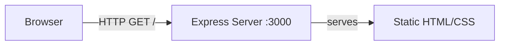

# Architecture

## Overview

A standalone Hello World web application. An Express server (TypeScript) serves a static HTML page on port 3000. The application is containerized via a multi-stage Docker build.

## Component Diagram

## Components

### Express Server (`src/index.ts`)
- Initializes Express application
- Serves static files from `public/` directory
- Listens on port 3000

### Static Assets (`public/`)
- `index.html` — Hello World page with inline or linked CSS
- Minimal, clean design with no JavaScript dependencies

### Dockerfile
- Multi-stage build: compile TypeScript, then run with Node.js runtime
- Exposes port 3000
- Uses `node:20-alpine` base image

## Data Flow

1. Browser sends HTTP GET request to `/`
2. Express serves `public/index.html` as a static file
3. Browser renders the Hello World page

## Deployment

The application runs as a single container. No external services, databases, or message queues are required.
